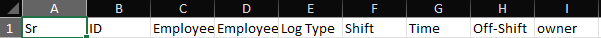
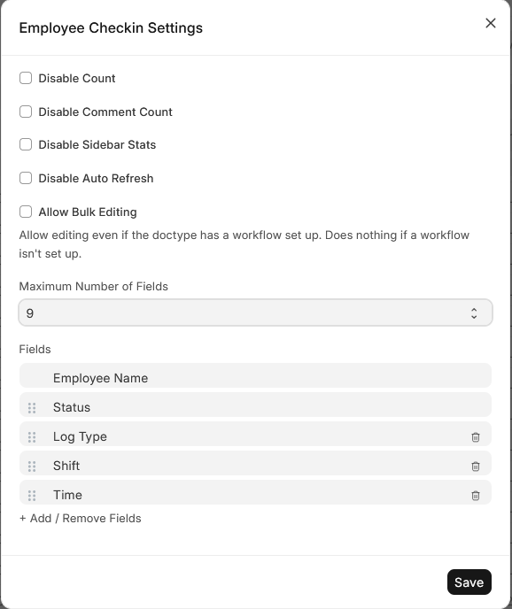
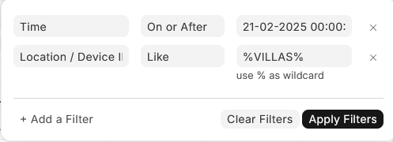

# Procesador de Checadas

Este script de Python proporciona una interfaz gráfica para procesar archivos Excel que contienen datos de checadas de empleados. Permite generar informes y realizar análisis de asistencia.

## Requisitos

Antes de ejecutar el script, asegúrate de tener instalados los siguientes componentes:

* **Python:** Versión 3.6 o superior.
* **Bibliotecas de Python:**
    * pandas
    * openpyxl
    * Pillow (PIL)

## Instalación

1.  **Instala Python:** Si aún no tienes Python instalado, descárgalo desde [python.org](https://www.python.org/downloads/) e instálalo.
2.  **Instala las bibliotecas:** Abre una terminal o símbolo del sistema y ejecuta el siguiente comando para instalar las bibliotecas necesarias:

    ```bash
    uv pip install pandas openpyxl Pillow
    ```

3.  **Archivo de Logo:**
    * Asegúrate de tener un archivo de imagen llamado `Logo_asia.png` en el mismo directorio donde se encuentra el script.
    * También puedes colocar el archivo `info.ico` en la misma carpeta que el script, este archivo es el icono de la ventana.
4.  **Archivo de Entrada Excel:**
    * El script requiere un archivo Excel con datos de checadas de empleados. Asegúrate de que el archivo tenga la estructura de columnas adecuada (por ejemplo, "Time", "Employee Name", "Shift").

## Uso

1.  Abre una terminal o símbolo del sistema, navega al directorio donde guardaste el script y ejecuta el siguiente comando:1

    ```bash
    uv run asistencia.pyw
    ```

3.  La interfaz gráfica se abrirá, permitiéndote seleccionar el archivo Excel de entrada y generar el informe.

## Notas adicionales

* El script está diseñado para procesar archivos Excel con una estructura de datos específica. Asegúrate de que tu archivo de entrada cumpla con los requisitos.
* Si tienes problemas con la instalación de las bibliotecas, asegúrate de que `pip` esté actualizado y de que tu entorno de Python esté configurado correctamente.

El archivo de entrada necesita los siguientes encabezados

Sr	ID	Employee Name	Employee	Log Type	Shift	Time	Off-Shift	owner


que puede obtenerse a partir de un reporte de frappe HR (erpnext hrms) con los siguientes campos

 
Para generar el reporte puede ser útil este filtro
